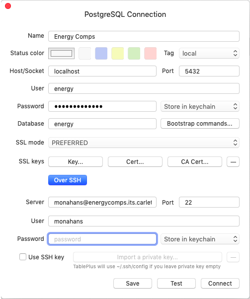

# Info/Resources for Energy Analytics Comps
Welcome to Energy Comps! This document should help you become more familiar with the structures already in place surrounding this comps project, including the Energy Server, Database, API, Website, Analysis, and other parts that previous groups have implemented/started implementing.

## Energy Server
To to access the database or other data from the energy server, your files must be on the server as well. This will walk you through how to connect to the server from your local device and how to navigate the server. Editors like [VS Code](https://code.visualstudio.com/) are very helpful when navigating the server and editing files - would recommend over only using vim.

### How to Connect
1. Open terminal or equivalent
2. Enter 'ssh [your carleton username]@energycomps.its.carleton.edu'
3. Type in your Carleton password when it promts you
    
    **Note:** If you are using an editor like VS Code, you just need to click the Remote SSH button, connect to host, and then add the energy server as a host. You will then be able to quickly connect to it anytime.

To set up an SSH key, which allows you to login without a password, check out [this site](https://www.cyberciti.biz/faq/how-to-set-up-ssh-keys-on-linux-unix/), or just look around for other resources online. This is extemely nice to have, since you will be logging onto the server a lot.

### Navigating
You will be set up with a home repository when you join this comps group, which is the best place to put your work that is in progress. When you log in to the server, this is where it dumps you. To get to the rest of the server, enter 'cd /' into your terminal, and you will be where all of the rest of the code is.
#### Where you can find some important code in the server (and links to github):
- Website Frontend: [/var/www/frontend](https://github.com/carleton-cs-energy-analytics/frontend)
- Database: [/var/www/backend/backend/database](https://github.com/carleton-cs-energy-analytics/backend/tree/master/backend/database)
    - Tables: [/var/www/backend/migrations](https://github.com/carleton-cs-energy-analytics/backend/tree/master/migrations)
- API: [/var/www/backend/backend/api](https://github.com/carleton-cs-energy-analytics/backend/tree/master/backend/api)
- Analysis [/var/www/backend/data-analysis](https://github.com/carleton-cs-energy-analytics/data-analysis)
- Uploaded raw data files: var/data/uploads/siemens

## Energy Analytics Comps Github
If you are working on this comps project, you should be in the carleton-cs-energy-analytics Github group. We currently (Spring 2021) have 12 repositories (plus this README repository), where some are used on the server, while others are not. Each relevant repository has a README that should guide you through exactly what that repository has in it and what those files do. All of the relevant website, database, analysis, API etc. files are included in repositories that have been modified since 2018, so chances are you do not need to pay attention to those older repositories.

## Getting Started With the Database:
### How to Connect
- First, it’s easiest to look at the database with a database UI, like [TablePlus](https://tableplus.com/)
- To connect to the database, click 'Create new connection...', choose PostgreSQL connection and fill in the info as shown below:

1. For the password in the upper section, use ‘less!29carbon’
2. Click the ‘Over SSH’ button on the bottom of the screen
3. For the Server, User, and Password in the lower section, type in your relevant information that you use to get into the energycomps server (Carleton username and password)
4. Click ‘Connect’
    - **Remember**: you have to be connected to Carleton wifi or the [Carleton VPN](https://www.carleton.edu/its/services/accounts/off-campus/) to connect to the server

### More Useful Database Information
- To understand what the database tables mean and how they are connected, check out [backend/migrations/schema.sql](https://github.com/carleton-cs-energy-analytics/backend/blob/master/migrations/schema.sql) on the github.
- To find some useful queries to the database, check out the [backend/migrations](https://github.com/carleton-cs-energy-analytics/backend/tree/master/migrations) README
- To add more points/buildings to the database, see the README in the [point-importer](https://github.com/carleton-cs-energy-analytics/point-importer) repository on the Github

## Using the API
- It's easiest to just type in the URL's for the API into your browser search bar
- Check out the documentation [here](https://documenter.getpostman.com/view/14650000/TzJsfy7D). This is also on the [Energy Comps Dashboard](http://energycomps.its.carleton.edu/) under ‘API Documentation’
- API routes on the Github [here](https://github.com/carleton-cs-energy-analytics/backend/blob/master/backend/api/routes.py)
    - **Remember**: you have to be connected to Carleton wifi or the [Carleton VPN](https://www.carleton.edu/its/services/accounts/off-campus/) to use the API

## Website
### Contents
The Energy Analytics Dashboard is where all of our analysis is displayed for staff or anyone to view. It includes Trends, Anomalies, API Documentation and Rules. At the moment (Spring 2021), Anomalies is where we display all of our anomalies detected by our analysis and API Documantation links to a Postman page. Trends allows you to graph data that is being collected, but is not really used for analysis. The rules tab is now mostly outdated, as we are now using ML anomaly detection techniques instead of Rules.

### Where Code is Found/How to Change it
The code for the website is found in the [frontend](https://github.com/carleton-cs-energy-analytics/frontend) repository on the github or in /var/www/frontend on the server. For more information on how it works and how to change the website, check out the README for the frontend github repo.

## Analysis/Anomaly Detection
In our 2021 comps group, we started performing analysis on the energy data dectecting anomalies. The [data-analysis repository](https://github.com/carleton-cs-energy-analytics/data-analysis) holds all of our ML and heuristics algorithms that search for anomalies, specifically in stl.py. Check out README.md for more information on how it works/how to expand on

## Brick
Brick is a standard for naming and connections between building devices. As of now, we have a script that takes the hierarchy we have in the database (buildings, floors, rooms, points) and puts them into a brick Graph, which is an RDF graph. We also have a python graph that mimics this, but the Brick one is more useful (or will be). Now that we have the graph, the next step is figuring out how to query it. You have to use SPARQL to query it, but we did not have time to figure that out fully this year (2021). Here is some documentation for SPARQL: [here](https://sparqlwrapper.readthedocs.io/en/latest/main.html) and [here](https://www.w3.org/TR/rdf-sparql-query/). To get a feel for things, check out below for the code that we have and some useful resources.
- What we have now: [Brick repository](https://github.com/carleton-cs-energy-analytics/Brick)
    - See README for more info
- Getting started with Brick: https://brickschema.org/get-started/
- Documentation for standard Brick Objects: https://brickschema.org/ontology/
- [Brick Studio](https://brickschema.org/tools/BrickStudio/), for creating visualizations of the Brick graphs
    - Click 'Website' to upload your graph
    - You only need to upload the .ttl document that makeBrick.py outputs
- Tools to potentially use for further analysis:
    - [Mortar Data](https://mortardata.org/)
    - [Brick Server](https://github.com/BrickSchema/brick-server)

In the future, we hope that Brick will allow Carleton to expand on our Energy Analytics by connecting our buildings, points, etc. to standard tags and maybe use other people's tools in our analysis, since Brick is an industry standard. Others have started to develop tools using Brick, so if you are able to contact these people, the software that they have written would be extremely useful for this project.